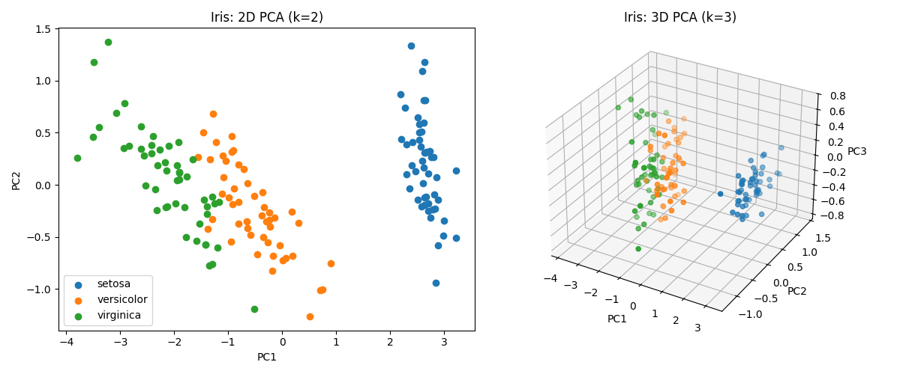
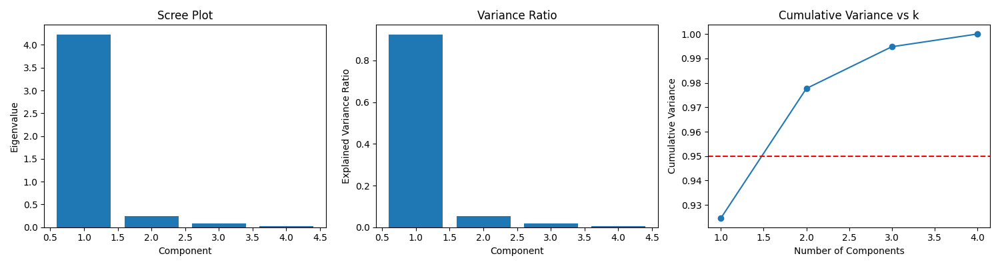
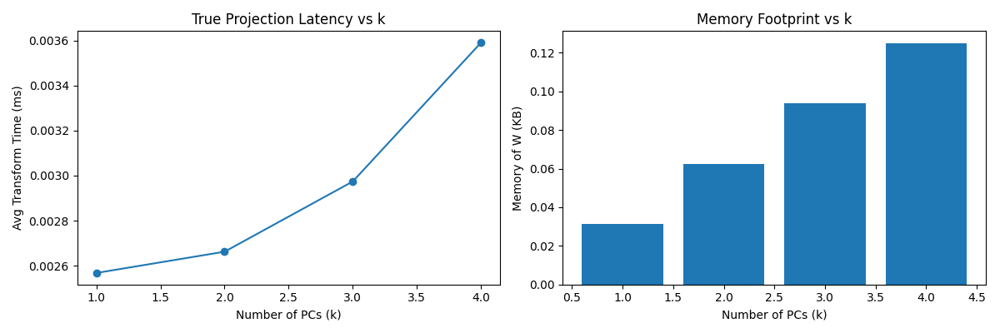
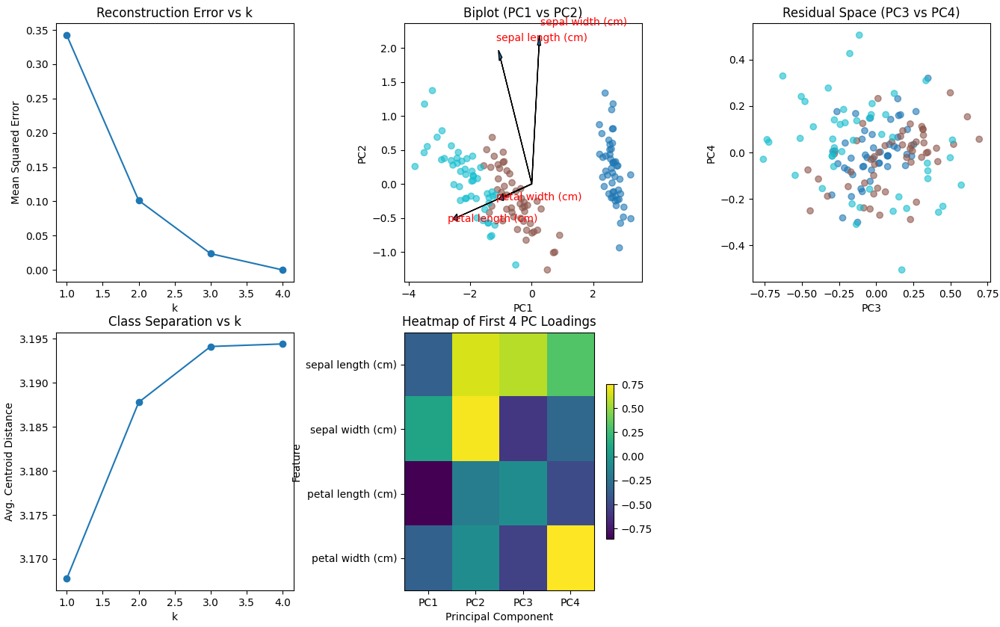
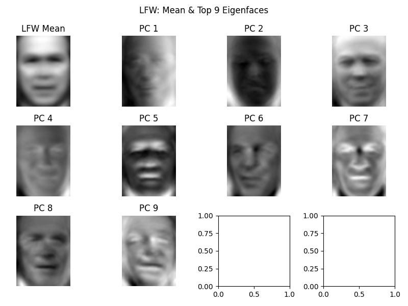
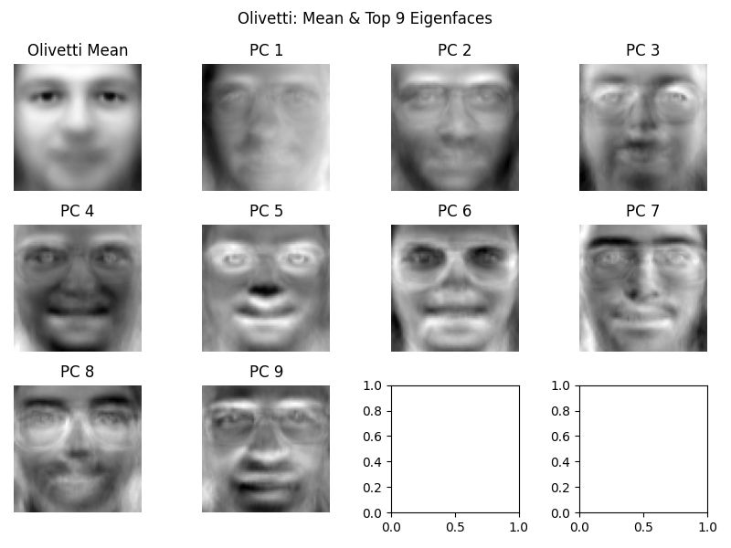
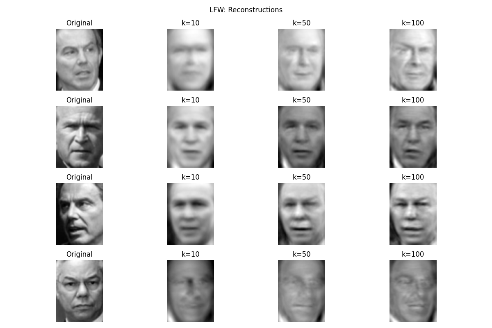
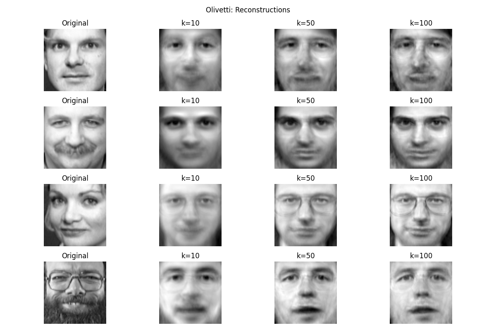
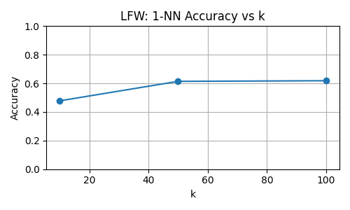
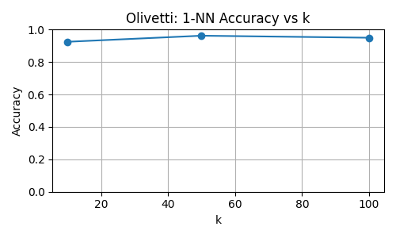

# 🧠 Principal Component Analysis & Eigenfaces – Final Lab Submission

This project showcases **Principal Component Analysis (PCA)** applied to both structured and high-dimensional image datasets. Two classic pipelines are implemented entirely **from scratch**, with insightful evaluation:

- 🟢 **PCA on Iris Dataset** – dimensionality reduction + trade-off exploration
- 🟣 **Eigenface Method** – face compression + recognition on Olivetti (optionally LFW)

This lab goes beyond coding: we measure **accuracy vs compression**, plot **latency/memory trade-offs**, and analyze **reconstruction quality vs. eigen-space size**.

---

## 📌 1. PCA on Iris Dataset

**Objective:** Reduce the 4D measurement space of flowers into lower dimensions while preserving structure, interpretability, and efficiency.

🔍 *Even 2D PCA clearly separates Setosa; 3D PCA strengthens separation for Versicolor and Virginica.*

🧩 *Most variance is captured by PC1–PC2. Scree plot reveals redundancy in PC3–4. PC1 correlates strongly with petal features.*

📉 *Latency rises with \(k\) due to matrix size; memory grows linearly. There's diminishing return beyond \(k=2\).*

🧠 *Reconstruction error drops fast with \(k\), centroid distance saturates, biplot reveals direction of feature influence.*

✅ **Conclusion:** PCA effectively reduces dimensionality while preserving most variance in just 2–3 components. It's ideal for structured data visualization and compression.

---

## 👤 2. PCA for Face Recognition: Eigenfaces on LFW & Olivetti

**Objective:** Learn principal components of human faces and evaluate trade-offs in compression, reconstruction, and identity recognition.

🔍 *Eigenfaces capture lighting and pose variations more than identity — LFW is challenging due to uncontrolled image conditions.*

🧠 *Eigenfaces here encode more identity-related features like glasses, hair, and face shape — thanks to aligned, clean input.*

🧩 *Reconstruction improves with higher \(k\); \(k=100\) closely resembles originals, but earlier \(k\) still retain rough identity.*

🎯 *Very good quality at \(k=50\). Olivetti reconstructions preserve more sharpness — validating PCA with clean datasets.*

📎 *Recognition saturates at ~62% with \(k=50–100\); PCA struggles due to intra-class variability in LFW.*

✅ *~96% accuracy at \(k=50\) proves PCA is effective in controlled face settings.*

✅ **Conclusion:** Eigenfaces compress and reconstruct faces effectively, and allow basic recognition. They perform well in clean datasets but are challenged in real-world conditions.

---

## ✅ Submission Checklist

- ✅ Custom PCA implementation (no `sklearn.PCA`)
- ✅ Two use cases: numerical data + image data
- ✅ Reconstruction, classification, trade-off analysis
- ✅ Annotated plots & visual comparisons
- ✅ Final README with interpretation and insights

---

## 📄 License

MIT License – Free to use, adapt, extend.
